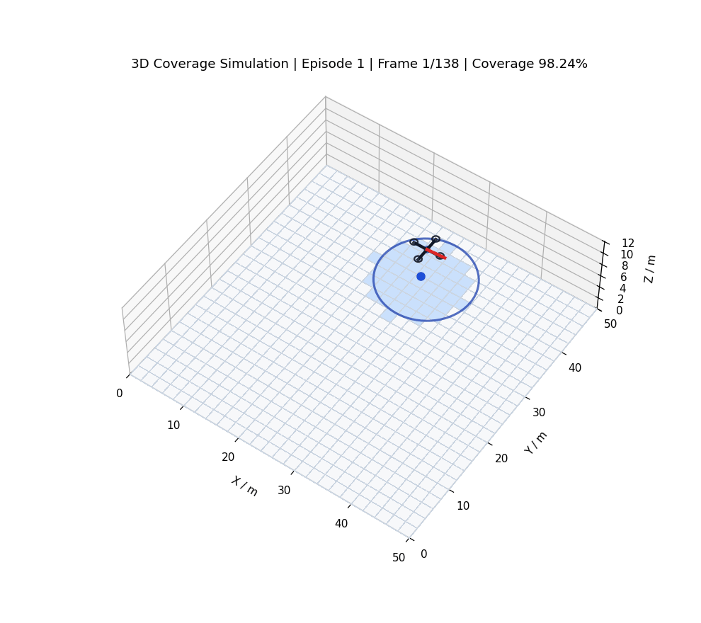
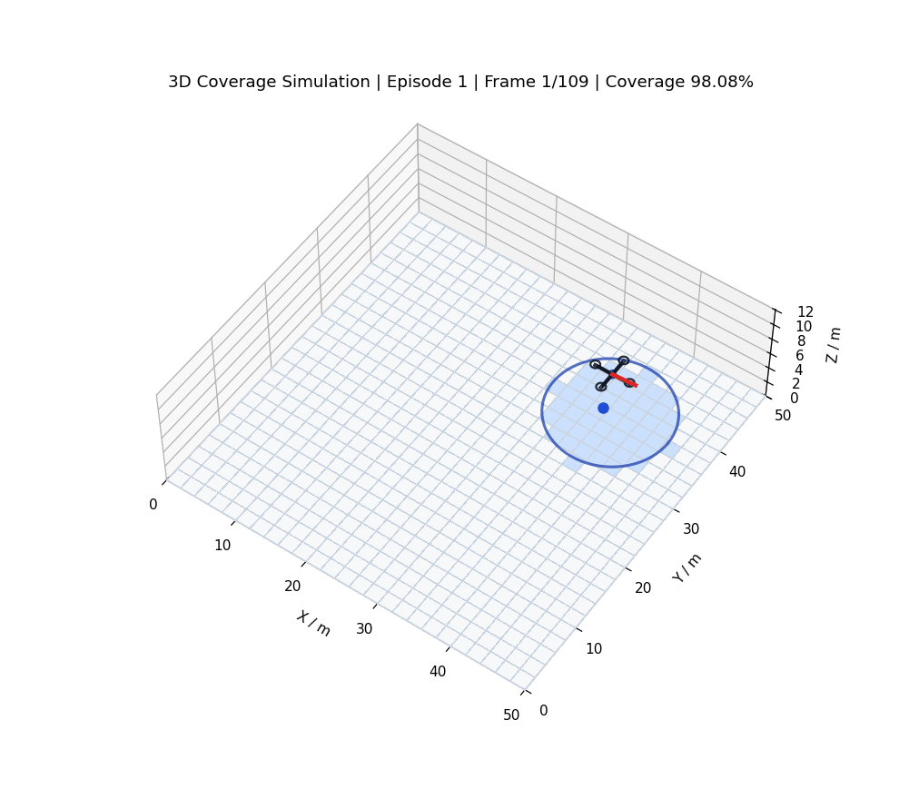
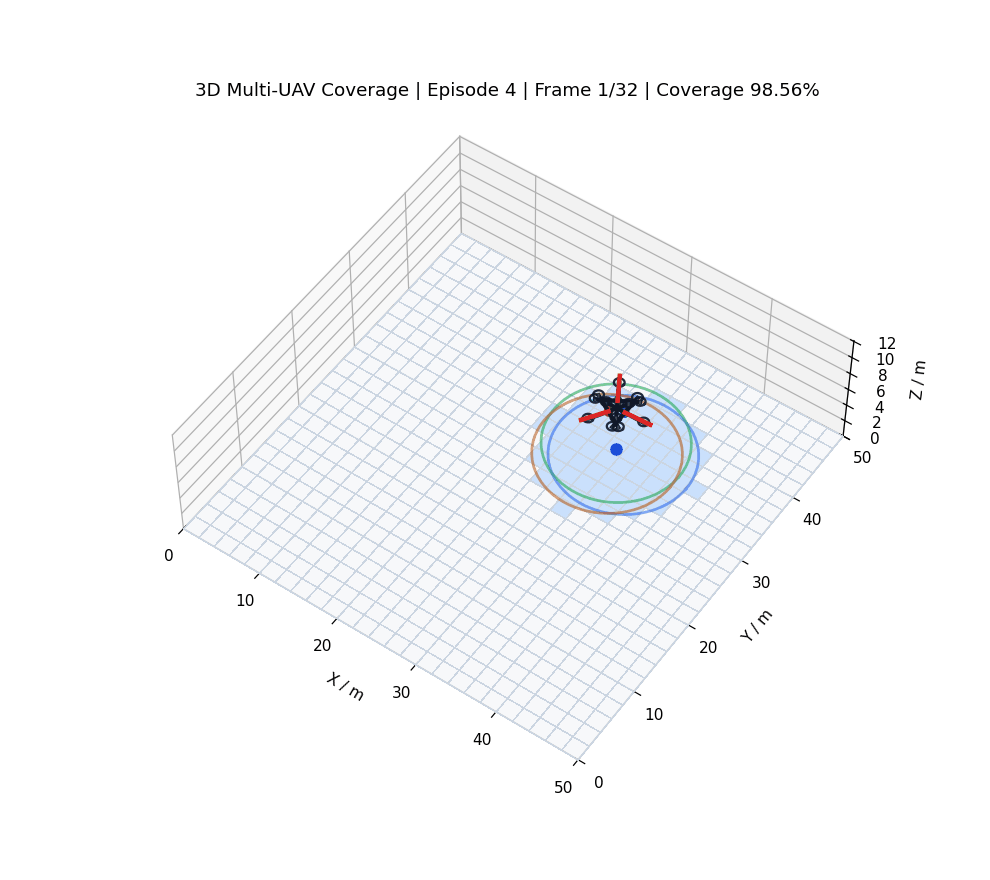

# UAV Coverage PPO

基于 `Stable-Baselines3` 的无人机覆盖扫描强化学习实验仓库。当前仓库包含三套可独立运行的实验：

- `single_uav_cover`：单无人机、单层 PPO 覆盖扫描
- `single_uav_cover_hl`：单无人机、分层 PPO（上层选区域，下层做连续控制）
- `multi_uav_cover_hl`：多无人机、集中式高层 PPO + 共享低层 PPO

环境本体是二维覆盖任务；`simulation/` 里的脚本会把轨迹抬升到固定高度，导出 3D GIF 方便展示。

| 单无人机 PPO | 单无人机分层 PPO | 多无人机分层 PPO |
|---|---|---|
|  |  |  |

## 目录结构

```text
.
├── single_uav_cover/
│   ├── env.py
│   ├── global_guidance.py
│   ├── train.py
│   ├── model/                         # 仓库内置单层示例权重
│   └── simulation/
├── single_uav_cover_hl/
│   ├── env.py
│   ├── high_level_env.py
│   ├── train_high_level.py
│   ├── low_model/                     # 仓库内置低层示例权重
│   ├── high_model/                    # 仓库内置高层示例权重
│   └── simulation/
└── multi_uav_cover_hl/
    ├── env.py
    ├── multi_high_level_env.py
    ├── train_multi_high_level.py
    ├── low_model/                     # 仓库内置共享低层示例权重
    ├── high_model/                    # 仓库内置多机高层示例权重
    └── simulation/
```

## 方法概览

### 1. 单层 PPO

`single_uav_cover/env.py` 直接定义二维覆盖环境：

- 动作：连续 `Box`，每步输出 `[v, w]`
- 奖励：新覆盖、重复覆盖惩罚、动作平滑、步长惩罚、引导点距离变化、终止奖励
- 终止：碰撞 / 越界，或达到覆盖率目标

### 2. 单无人机分层 PPO

`single_uav_cover_hl/high_level_env.py` 的思路是：

1. 上层 PPO 选择离散区域 `region_id`
2. 区域中心转成世界坐标引导点
3. 下层 PPO 在 `option_horizon` 步内执行连续控制
4. 上层根据覆盖增量、移动代价、切换代价等获得奖励

### 3. 多无人机分层 PPO

`multi_uav_cover_hl/multi_high_level_env.py` 使用集中式高层策略：

- 动作空间：`MultiDiscrete([num_regions] * num_agents)`
- 每个 agent 独立分配目标区域
- 所有 agent 共享一个下层 PPO
- team reward 会额外惩罚目标重复、目标过近、扫描重叠、机间过近和机间碰撞

## 环境依赖

建议使用 `Python 3.10+`。最少需要：

```bash
pip install numpy gymnasium matplotlib pillow torch stable-baselines3
```

如果你希望使用训练脚本里的 `progress_bar=True`，再补：

```bash
pip install tqdm rich
```

如果你使用 conda，仓库里的部分脚本已经内置了这些兼容处理：

- `MKL_THREADING_LAYER=GNU`
- `OMP_NUM_THREADS=1`
- 多机脚本会优先使用当前 conda 环境里的 `libstdc++`

## 快速开始

### 单无人机 PPO

训练：

```bash
cd single_uav_cover
python train.py
```

输出位置：

- checkpoint：`single_uav_cover/check_point/version_N/model/`
- TensorBoard：`single_uav_cover/check_point/version_N/tensorboard/`

使用仓库内置示例权重导出 GIF：

```bash
cd single_uav_cover
python simulation/simulate_high_level_3d.py \
  --model model/ppo_model_last.zip \
  --episodes 1
```

### 单无人机分层 PPO

当前仓库已经带了可直接可视化的示例权重：

- 低层：`single_uav_cover_hl/low_model/ppo_low_last.zip`
- 高层：`single_uav_cover_hl/high_model/ppo_high_last.zip`

直接导出 GIF：

```bash
cd single_uav_cover_hl
python simulation/simulate_high_level_3d.py \
  --low-model low_model/ppo_low_last.zip \
  --high-model high_model/ppo_high_last.zip \
  --episodes 1
```

训练高层前要注意一件事：`train_high_level.py` 里的 `TrainHighLevelConfig.low_level_model_path` 默认值还是 `low_model/ppo_model_save.zip`，而仓库当前实际文件名是 `low_model/ppo_low_last.zip`。训练前需要先把这个路径改成你要用的低层模型。

训练命令：

```bash
cd single_uav_cover_hl
python train_high_level.py
```

输出位置：

- checkpoint：`single_uav_cover_hl/check_point_high_level/version_N/model/`
- TensorBoard：`single_uav_cover_hl/check_point_high_level/version_N/tensorboard/`

### 多无人机分层 PPO

仓库内置示例权重：

- 低层：`multi_uav_cover_hl/low_model/ppo_low_last.zip`
- 高层：`multi_uav_cover_hl/high_model/ppo_high_last.zip`

训练高层：

```bash
cd multi_uav_cover_hl
python train_multi_high_level.py \
  --low_model low_model/ppo_low_last.zip \
  --num_agents 3 \
  --n_envs 8 \
  --total_timesteps 2000000
```

常用参数：

- `--grid_bins`：区域划分粒度，默认 `5`
- `--option_horizon`：每次高层决策下层执行步数，默认 `15`
- `--max_high_steps`：每回合最大高层步数，默认 `80`
- `--use_subproc`：启用 `SubprocVecEnv`

输出位置：

- checkpoint：`multi_uav_cover_hl/check_point_multi_high_level/version_N/model/`
- TensorBoard：`multi_uav_cover_hl/check_point_multi_high_level/version_N/tensorboard/`

导出 GIF：

```bash
cd multi_uav_cover_hl
python simulation/simulate_high_level_3d.py \
  --low-model low_model/ppo_low_last.zip \
  --high-model high_model/ppo_high_last.zip \
  --num-agents 3 \
  --episodes 1
```

## TensorBoard

单无人机 PPO：

```bash
tensorboard --logdir single_uav_cover/check_point
```

单无人机分层 PPO：

```bash
tensorboard --logdir single_uav_cover_hl/check_point_high_level
```

多无人机分层 PPO：

```bash
tensorboard --logdir multi_uav_cover_hl/check_point_multi_high_level
```

## 运行约定

- 这些脚本多数使用了 `from env import ...` 这样的本地导入，所以请进入各自子目录后再执行。
- `simulation/` 里的默认模型路径并不完全都和当前仓库重构后的目录一致；最稳妥的方式是像上面的示例一样显式传参。
- 训练脚本保存的新权重通常在 `check_point*` 目录下；而仓库里 `model/`、`low_model/`、`high_model/` 更多是示例或最近一次导出的权重。

## 后续建议

如果你准备继续迭代这个仓库，比较值得优先整理的是：

1. 给三个实验统一补一份 `requirements.txt` 或 `environment.yml`
2. 统一模型文件命名，消除 `ppo_model_save.zip` / `ppo_low_last.zip` 这类历史残留
3. 把各训练脚本都补成完整 CLI，避免必须手改源码参数
